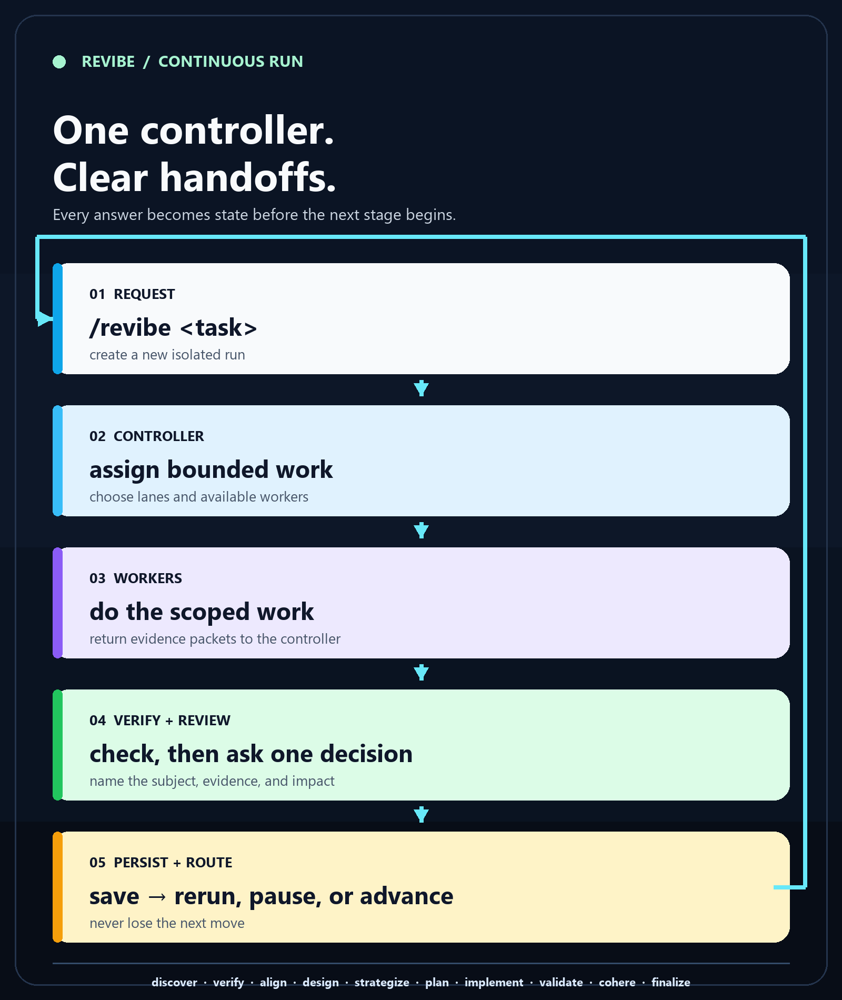

<div align="center">

# REVibe

### Turn an ambiguous coding request into a verified, resumable run.

<p>
  One controller. Bounded worker assignments. Clear user decisions.<br/>
  Every stage leaves evidence and a durable next move.
</p>

[](https://github.com/MPSMeridiaN/REVibe/releases/latest)
[](https://github.com/MPSMeridiaN/REVibe/actions/workflows/check.yml)
[](LICENSE)

**[Install](#install)** · **[See the workflow](#how-it-works)** · **[Read the docs](#documentation)**

</div>

<p align="center">
  
</p>

## Why REVibe

AI coding work often loses the thread between discovery, implementation, and review:

- the agent starts changing files before the request is understood;
- worker output is accepted without checking evidence or scope;
- questions refer to “the ten features” without naming the actual claim;
- a new chat cannot tell which run, baseline, or decision it is resuming.

REVibe gives the work one controller and a durable contract. It delegates substantive lanes to available subagents, verifies what comes back, asks one contextual decision at a time, and continues only from saved state.

## How it works

```text
/revibe <request>
       │
       ▼
controller selects a run and assigns bounded work
       │
       ▼
workers investigate, change, or validate their scoped lane
       │
       ▼
controller checks evidence, writes the handoff, asks one clear question
       │
       ├── feedback → rerun the affected scope
       ├── pause / blocker → save a checkpoint
       └── accepted → continue to the next stage
```

The ten stages are deliberately separate so each decision has a clear owner:

`discover` → `verify` → `align` → `design` → `strategize` → `plan` → `implement` → `validate` → `cohere` → `finalize`

Questions always identify the subject, current claim, evidence, downstream impact, and recommended choice. Each review ends with:

> Is there anything REVibe missed, misunderstood, or that you want to add?

An answer continues the same run. Feedback reruns the affected stage. Silence stays waiting; it never becomes approval.

## Install

Run this from the project the agent should work on:

```sh
# project-local (recommended)
npx -y MPSMeridiaN/REVibe --local

# current-user global
npx -y MPSMeridiaN/REVibe --global
```

Use `--harness <name>` when a native harness destination is required. The installer changes only the selected skills directory and installs the 11 REVibe skills.

Remove the same scope you installed:

```sh
npx -y MPSMeridiaN/REVibe --local --uninstall
npx -y MPSMeridiaN/REVibe --global --uninstall
```

Uninstall removes only the exact REVibe skill names shipped by this package. It preserves unrelated skills, unknown `revibe-*` directories, and every project run under `.revibe/`.

## Runs stay isolated

Every request gets its own run directory, so separate assignments never merge histories:

```text
.revibe/<run-id>/
├── state.json       # canonical controller state
├── handoffs/        # reviewed stage checkpoints
├── evidence/        # bounded logs and references
└── archive/         # superseded material kept for traceability
```

Resume an exact assignment with:

```text
/revibe resume <run-id>
```

The controller validates the run identity and baseline before continuing. Legacy `.revibe/state.json` is preserved and can only be selected explicitly.

## What you get

| Need | REVibe gives you |
| --- | --- |
| Unclear scope | A reviewed discovery and alignment record before implementation |
| Parallel work | Bounded worker packets with explicit ownership and completion criteria |
| Trustworthy progress | Evidence checks, focused follow-ups, and durable handoffs |
| Changing direction | Stale dependent stages and targeted reruns instead of silent drift |
| Interrupted sessions | Run selection, checkpoints, recovery, and an explicit next action |
| Multiple tasks in one repo | Isolated `.revibe/<run-id>/` state with no automatic history merge |

## Documentation

- [Workflow, questions, handoffs, and recovery](docs/workflow.md)
- [Installation, harnesses, offline mode, and removal](INSTALL.md)
- [Harness capability matrix](docs/harnesses.md)
- [Validation and evidence contract](docs/validation.md)
- [Development and release checks](CONTRIBUTING.md)
- [Versioned changelog](CHANGELOG.md)

## Releases

Releases are created automatically on every push to `main`. The workflow reads the semantic version from [`VERSION`](VERSION), validates the package, generates matching release notes, uploads the ZIP and checksum, and retires obsolete commit-hash releases.

REVibe is a reasoning workflow, not a correctness guarantee. Confidence is bounded by the evidence available to the executing harness.
