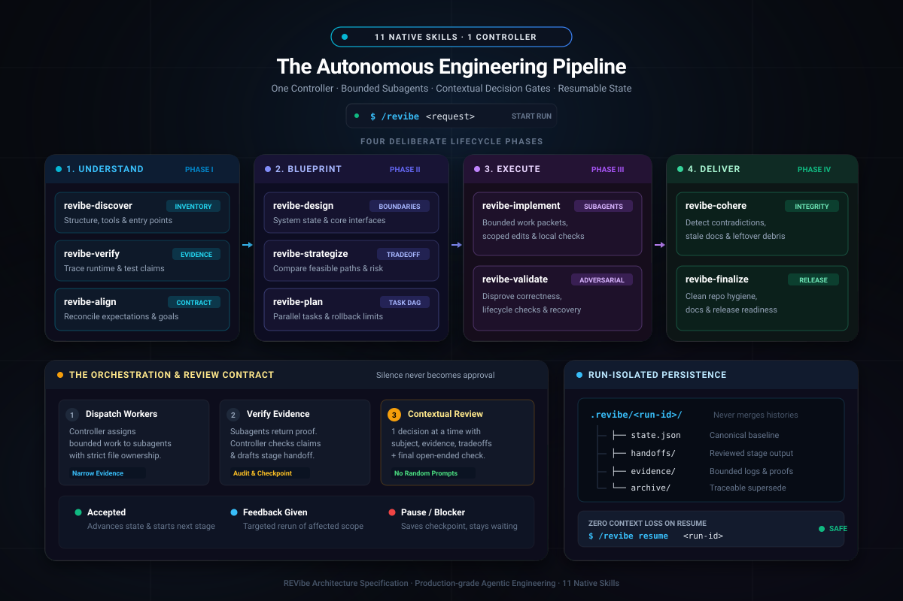

<div align="center">

# REVibe

### The 11-Skill Autonomous Engineering Suite for AI Coding Agents

<p align="center">
  <b>Turn ambiguous coding requests into verified, evidence-backed, resumable runs.</b><br/>
  One controller · Bounded subagents · Contextual review questions · Resumable state isolation.
</p>

<p align="center">
  <a href="https://github.com/MPSMeridiaN/REVibe/releases/latest"></a>
  <a href="https://github.com/MPSMeridiaN/REVibe/actions/workflows/check.yml"></a>
  <a href="LICENSE"></a>
  
  
</p>

<p align="center">
  <b><a href="#quickstart">Quickstart</a></b> · <b><a href="#the-orchestration-loop">Orchestration Loop</a></b> · <b><a href="#the-11-skills">The 11 Skills</a></b> · <b><a href="#why-revibe">Why REVibe</a></b> · <b><a href="#documentation">Documentation</a></b>
</p>

</div>

<p align="center">
  
</p>

---

## What is REVibe?

REVibe is **not a bloated framework, heavy runtime, or closed SaaS**. It is a portable suite of **11 native agent skills** designed to install directly into your AI coding assistant (Claude Code, Cursor, Windsurf, OpenCode, Gemini, Cline, Kiro, Qwen, etc.).

When an agent works without a protocol, it edits files prematurely, invents assumptions, accepts hallucinated subagent outputs, and asks vague questions like *"confirm the 10 features"*.

REVibe transforms your agent into a disciplined engineering team:
- **One Controller** owns the conversation, manages run-isolated state, and dispatches bounded work.
- **Specialized Subagents** investigate, design, code, and test within strictly defined file boundaries.
- **Contextual Review Contract**: Every question explains *what it is, where it came from, observed evidence, downstream impact, and recommended choice*—ending with an open-ended feedback prompt.
- **Automatic Continuation**: The controller loops through all 10 stages automatically, rerunning only affected scopes when feedback is given, and checkpointing safely if blocked.

---

## The Orchestration Loop

```text
               User Prompt: /revibe <task>
                             │
                             ▼
┌──────────────────────────────────────────────────────────────┐
│                      CONTROLLER ROUTER                       │
│  • Selects / creates isolated run: .revibe/<run-id>/         │
│  • Deconstructs task into bounded packets with file scopes   │
└──────────────────────────────┬───────────────────────────────┘
                               │ Dispatches bounded lanes
                               ▼
┌──────────────────────────────────────────────────────────────┐
│                     SUBAGENTS / WORKERS                      │
│  • Investigate, implement, or validate within assigned scope │
│  • Return narrow evidence packets (never touch global state) │
└──────────────────────────────┬───────────────────────────────┘
                               │ Returns evidence packet
                               ▼
┌──────────────────────────────────────────────────────────────┐
│                   EVIDENCE AUDIT & HANDOFF                   │
│  • Verifies returned evidence against completion criteria    │
│  • Prepares stage handoff (.revibe/<run-id>/handoffs/*.md)   │
└──────────────────────────────┬───────────────────────────────┘
                               │ Formulates contextual questions
                               ▼
┌──────────────────────────────────────────────────────────────┐
│                 CONTEXTUAL HUMAN REVIEW                      │
│  1. Subject: Named feature / boundary in plain language      │
│  2. Meaning: What this means in practice                     │
│  3. Origin: Source artifact, file path, line numbers         │
│  4. Observed: Concrete evidence, logs, test findings         │
│  5. Impact: Downstream effect of accepting / rejecting       │
│  6. Decision: Recommended choice + trade-offs + custom path  │
│  ──────────────────────────────────────────────────────────  │
│  Final Question: "Is there anything REVibe missed,          │
│                   misunderstood, or that you want to add?"   │
└──────────────────────────────┬───────────────────────────────┘
                               │
            ┌──────────────────┴──────────────────┐
            ▼                                     ▼
      [ Feedback Given ]                     [ Accepted ]
            │                                     │
   Marks affected scope stale          Commits state.json + handoff
   and reruns targeted lane            and auto-advances to next stage
            │                                     │
            └──────────────────┬──────────────────┘
                               │
                               ▼
               Cycles through the 10 stages:
   discover → verify → align → design → strategize →
   plan → implement → validate → cohere → finalize
```

---

## The 11 Skills

REVibe ships as 11 decoupled, cohesive skill modules mapped across 4 deliberate engineering phases:

| Phase | Skill | Role | Primary Objective |
| :--- | :--- | :--- | :--- |
| **Router** | [`revibe`](product/skills/revibe/SKILL.md) | **Workflow Controller** | Initializes run, manages DAG dependencies, routes stages, enforces review contract |
| **1. Understand** | [`revibe-discover`](product/skills/revibe-discover/SKILL.md) | Repo Inventory | Inventories structure, tools, entry points, and candidate features |
| | [`revibe-verify`](product/skills/revibe-verify/SKILL.md) | Runtime Trace | Gathers behavioral evidence and separates claims from reality |
| | [`revibe-align`](product/skills/revibe-align/SKILL.md) | Intent Reconciliation | Reconciles discrepancies into an accepted target definition |
| **2. Blueprint** | [`revibe-design`](product/skills/revibe-design/SKILL.md) | System Architecture | Models whole-system boundaries, interfaces, state, and security |
| | [`revibe-strategize`](product/skills/revibe-strategize/SKILL.md) | Trade-off Analysis | Evaluates solution directions, migration paths, and risk profiles |
| | [`revibe-plan`](product/skills/revibe-plan/SKILL.md) | Task DAG | Converts strategy into bounded, dependency-aware work packets |
| **3. Execute** | [`revibe-implement`](product/skills/revibe-implement/SKILL.md) | Subagent Coordination | Orchestrates scoped edits with continuous verification gates |
| | [`revibe-validate`](product/skills/revibe-validate/SKILL.md) | Adversarial Testing | Attempts to disprove correctness via lifecycle & failure checks |
| **4. Deliver** | [`revibe-cohere`](product/skills/revibe-cohere/SKILL.md) | Cross-layer Audit | Detects cross-layer contradictions, stale docs, and leftover debris |
| | [`revibe-finalize`](product/skills/revibe-finalize/SKILL.md) | Release Readiness | Audits repository hygiene, documentation, and release readiness |

---

## Quickstart

### 1. Install Skills into Your Repository

Run this in the project root where your AI coding assistant operates:

```sh
# Project-local installation (recommended)
npx -y MPSMeridiaN/REVibe --local

# Global installation (current user)
npx -y MPSMeridiaN/REVibe --global
```

*Compatible with Claude Code, Cursor, Windsurf, OpenCode, Gemini, Cline, and any agent supporting skill directories (`--harness <name>`).*

### 2. Run the Workflow

Start any complex assignment with:

```text
/revibe Refactor the authentication layer to support session revocation
```

### 3. Resume Anytime Without Context Loss

If you close the session, switch chats, or pause work, resume with zero memory drift:

```text
/revibe resume <run-id>
```

---

## Runs Stay Isolated

Every task is isolated in its own directory under `.revibe/<run-id>/`, preventing history merges or polluted baselines across concurrent tasks:

```text
.revibe/<run-id>/
├── state.json       # Canonical controller state & dependency graph
├── handoffs/        # Reviewed stage artifacts with evidence & trace
├── evidence/        # Bounded logs, traces, and reproduction proofs
└── archive/         # Superseded records preserved for auditability
```

---

## Why REVibe

| Common Failure in AI Coding | How REVibe Solves It |
| :--- | :--- |
| **Premature file modifications** | Enforces discovery, verification, and alignment before touching code |
| **Hallucinated subagent outputs** | Subagents return strict evidence packets audited by the controller |
| **Confusing, context-free questions** | Every question provides 6-part context (Subject, Meaning, Origin, Evidence, Impact, Recommendation) |
| **Silent assumptions & drift** | Feedback marks downstream dependencies stale; silence is never approval |
| **Lost context across chat sessions** | Runs persist in `.revibe/<run-id>/` and resume deterministically |
| **Accidental regressions & debris** | Dedicated coherence and adversarial validation stages before finalization |

---

## Documentation

- [Workflow, questions, handoffs, and recovery](docs/workflow.md)
- [Installation, harnesses, offline mode, and removal](INSTALL.md)
- [Harness capability matrix](docs/harnesses.md)
- [Validation and evidence contract](docs/validation.md)
- [Development and release checks](CONTRIBUTING.md)
- [Versioned changelog](CHANGELOG.md)

---

## Releases

Releases are published automatically on every push to `main`. The release workflow verifies semantic versioning from [`VERSION`](VERSION), packages the 11 skill modules, generates release notes, and attaches distribution bundles with SHA-256 checksums.

> *REVibe is a disciplined reasoning and orchestration protocol, not a correctness guarantee. Confidence is bounded by the empirical evidence available to the executing harness.*
