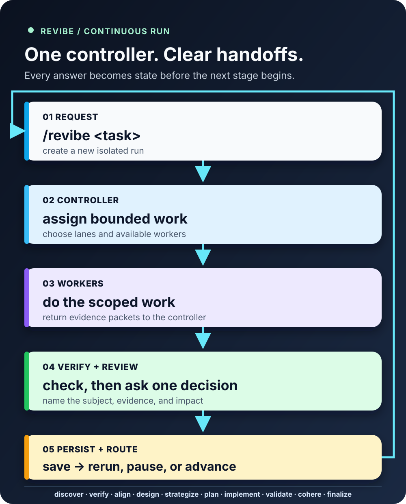

# REVibe

### A durable review loop for coding agents.

[](https://github.com/MPSMeridiaN/REVibe/releases/latest)
[](https://github.com/MPSMeridiaN/REVibe/actions/workflows/check.yml)
[](LICENSE)

REVibe turns a software request into a scoped, evidence-backed run. One
controller coordinates bounded work, verifies what came back, keeps the user in
the review loop, and leaves the next move in durable project files.



## Start a run

Use the host's REVibe command with the request in scope:

```text
/revibe <request>
```

The equivalent host skill form is `$revibe <request>`. Where neither command
exists, use plain language such as:

```text
Use REVibe to understand this project and help me decide what should change.
```

Every new task receives its own run directory:

```text
.revibe/<run-id>/
├── state.json
├── handoffs/
├── evidence/
└── archive/
```

Resume a specific run with `/revibe resume <run-id>`. A new task creates a new
run and never merges histories automatically. The older `.revibe/state.json`
layout remains a separate legacy run until you deliberately migrate it.

## The review loop

```text
discover → verify → align → design → strategize → plan →
implement → validate → cohere → finalize
```

At each stage, the controller reads the router protocol, immediately delegates
bounded substantive work, waits for final results, verifies material claims,
then asks the meaningful choices with evidence, tradeoffs, and a recommended
path. The review always ends with:

> Is there anything REVibe missed, misunderstood, or that you want to add?

Answering that there are no additions saves the matched state and handoff, then
automatically enters the next eligible stage. Feedback reruns the affected
work. An explicit stop saves a paused checkpoint. An unanswered review stays
waiting; it never becomes approval.

## Install

From the project the agent should work on:

```sh
# project-local, recommended
npx -y MPSMeridiaN/REVibe --local

# current-user global
npx -y MPSMeridiaN/REVibe --global
```

The installer places 11 skills in the selected skills directory and changes no
agent settings, services, accounts, or project configuration. For native
harness destinations, add `--harness <name>`; for a complete path matrix,
offline installation, updates, and removal, read the [installation guide](INSTALL.md).

To remove an install, use the same scope and harness or destination:

```sh
npx -y MPSMeridiaN/REVibe --local --uninstall
npx -y MPSMeridiaN/REVibe --global --uninstall
```

Uninstall removes only REVibe's reserved skill directories and legacy installer
bookkeeping. It preserves unrelated skills and every `.revibe/` run, including
legacy state.

## Read next

- [Installation and removal](INSTALL.md)
- [Workflow, runs, handoffs, and recovery](docs/workflow.md)
- [Harness support](docs/harnesses.md)
- [Development and release checks](CONTRIBUTING.md)
- [Changelog](CHANGELOG.md)

REVibe is a reasoning workflow, not a guarantee of correctness. Its confidence
is only as strong as the evidence the executing agent gathers.
