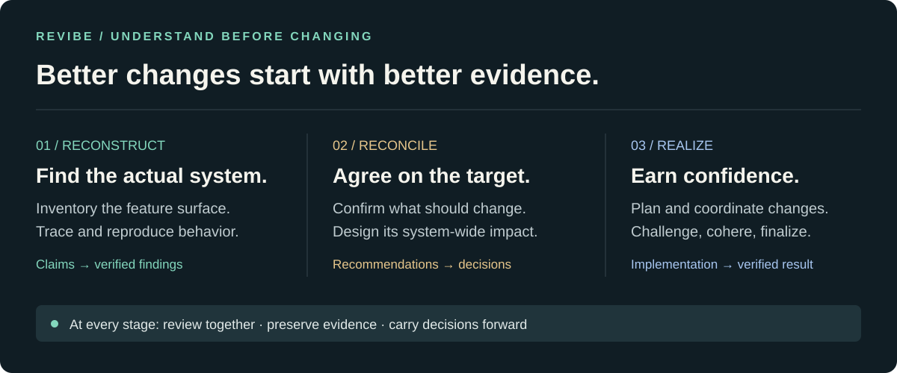
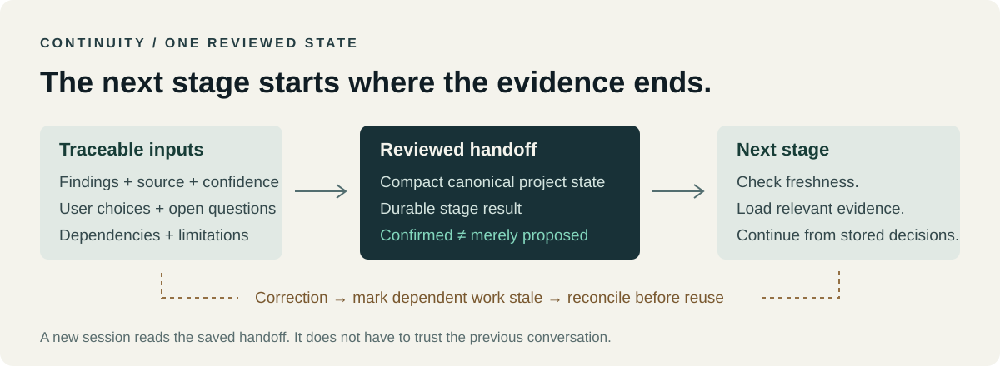

# REVibe

### The engineering operating system for AI coding agents.

[](https://github.com/MPSMeridiaN/REVibe/releases)
[](https://github.com/MPSMeridiaN/REVibe/actions/workflows/check.yml)
[](LICENSE)

Give an agent a repository URL. REVibe gives it a disciplined way to understand
what exists, separate evidence from assumptions, align changes with your intent,
and carry decisions all the way through implementation and validation.

> **inspect → verify → align → design → strategize → plan → implement → validate → cohere → finalize**



## Install in one command

Run the command from the project you want the agent to work on. No repository
clone is needed.

### Project-local — recommended

Installs only into the current project:

```sh
npx -y MPSMeridiaN/REVibe --local
```

Result: `./.agents/skills/`

This is the floating latest install: the GitHub package follows the repository's
default branch, so the command does not need a version edit for each release.
(`@latest` is npm registry syntax; for the current GitHub distribution, omitting
the ref is the equivalent.)

### User-global

Installs once for the current user:

```sh
npx -y MPSMeridiaN/REVibe --global
```

Result: `~/.agents/skills/`

The portable `.agents/skills` convention is the default because it is predictable
and recognized by multiple agent harnesses. Use a native target only when you
want one explicitly:

```sh
npx -y MPSMeridiaN/REVibe --local --harness claude
npx -y MPSMeridiaN/REVibe --local --harness cursor
```

If you want evidence-based adaptation, opt in explicitly with `--harness auto`.
It adapts only when `REVIBE_HARNESS` or one unambiguous project marker provides a
clear signal; otherwise it safely falls back to `.agents/skills`.

The remote launcher requires Node.js 18+ and Python 3.10+. A downloaded release
archive or development checkout can use the same installer directly:

```sh
python /path/to/revibe/install.py --local
python /path/to/revibe/install.py --global
```

Then tell your agent:

> Use revibe to understand this project. Start with discovery, show me what you found, and help me decide what should change.

## What changes after installation

REVibe adds 11 instruction-based skills and their shared references. It does not
add a service, account, MCP server, background process, or project configuration.

| Scope | Default destination | Best for |
| --- | --- | --- |
| Local | `<project>/.agents/skills/` | A repo-specific workflow and handoffs |
| Global | `~/.agents/skills/` | Making REVibe available across projects |
| Native harness | Harness-specific skills directory | An explicit Claude, Cursor, Gemini, OpenCode, or Codex target |

The installer records exactly what it owns. Reinstalling is safe, unchanged runs
are no-ops, updates remove stale REVibe skills, and unrelated skills are left
alone.

## The workflow

REVibe is a connected process, not a folder of unrelated prompts:

1. **Discover** what the project contains and claims.
2. **Verify** how it actually behaves.
3. **Align** the target with the user's intent.
4. **Design** the whole-system shape and boundaries.
5. **Strategize** the feasible solution and tradeoffs.
6. **Plan** executable work with dependencies and acceptance criteria.
7. **Implement** changes without losing the decisions behind them.
8. **Validate** by trying to disprove the result.
9. **Cohere** the system, documentation, tests, and behavior into one product.
10. **Finalize** the repository for use and maintenance.

Every stage produces a durable handoff and pauses for review where user judgment
matters. Findings, decisions, risks, questions, and stage progress live in the
project's `.revibe/` directory so a fresh session can resume without pretending
that missing context never existed.



## The skill suite

| Skill | Question it answers |
| --- | --- |
| `revibe` | Where should this run start or resume? |
| `revibe-discover` | What is here, and what does it claim to do? |
| `revibe-verify` | How does it actually behave, and why? |
| `revibe-align` | What do you want it to become? |
| `revibe-design` | What does that target mean across the system? |
| `revibe-strategize` | Which solution and tradeoffs should we accept? |
| `revibe-plan` | What work can be executed in what order? |
| `revibe-implement` | How do we coordinate changes without drifting? |
| `revibe-validate` | What survives attempts to break it? |
| `revibe-cohere` | Does the result make sense as one product? |
| `revibe-finalize` | Can someone build, use, and maintain it? |

## Why it holds up under real work

- **Truth stays separate from intent.** A document, a test, a runtime observation,
  and a user decision are not silently collapsed into one claim.
- **Review is part of the workflow.** Recommendations become accepted direction
  only after the user can confirm, correct, reject, defer, or replace them.
- **Continuity is explicit.** Handoffs carry evidence, uncertainty, dependencies,
  and revision context into the next stage.
- **Capability adapts honestly.** Agents can use tools, subagents, and harness
  features when available without treating missing capabilities as passing checks.

## Repository and product

| Repository | Product |
| --- | --- |
| Tests, validation, docs, packaging, CI, and release tooling | `product/skills/` and the installer |
| Maintainer-facing and development-only | The files copied into the selected skills directory |
| [Workflow docs](docs/workflow.md), [harness matrix](docs/harnesses.md), and [validation record](docs/validation.md) | The 11 skills plus shared protocol and state template |

## Learn more

- [Installation, removal, recovery, and advanced targets](INSTALL.md)
- [How state and handoffs work](docs/workflow.md)
- [Harness support and portable discovery](docs/harnesses.md)
- [Development and release checks](CONTRIBUTING.md)
- [MIT license](LICENSE)

REVibe is an engineering reasoning workflow, not a guarantee of correctness. Its
confidence is only as strong as the evidence the executing agent actually gathers.
