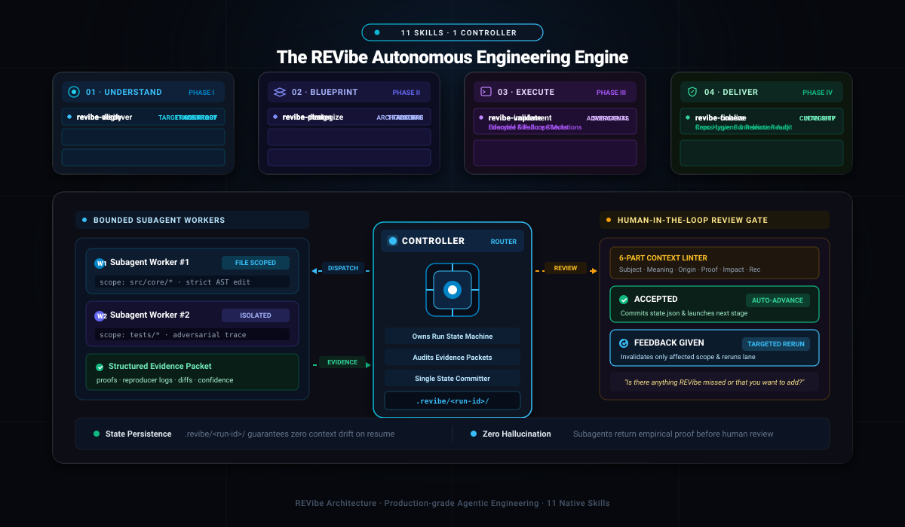

<div align="center">

# REVibe

### The 11-Skill Autonomous Engineering Suite for AI Coding Agents

<p align="center">
  <b>Turn chaotic, hallucinated prompts into verified, evidence-backed, resumable engineering runs.</b><br/>
  One controller · Bounded subagents · 6-part contextual review · Resumable state isolation.
</p>

<p align="center">
  <a href="https://github.com/MPSMeridiaN/REVibe/releases/latest"></a>
  <a href="https://github.com/MPSMeridiaN/REVibe/actions/workflows/check.yml"></a>
  <a href="LICENSE"></a>
  <a href="#the-11-skills"></a>
</p>

<br/>



<br/>
<br/>

</div>

## The Problem with AI Coding Agents

Every developer who uses coding assistants (Claude Code, Cursor, Windsurf, OpenCode, Cline) knows this pain:

1. **Premature Mutations**: You ask for a feature, and within 30 seconds the agent edits 15 files without understanding your architecture.
2. **Hallucinated Assumptions**: It invents internal APIs or assumes your database works in ways it never did.
3. **Exhausting, Context-Free Questions**: It drops a vague prompt like *"I found 10 features, confirm them"* with zero file paths, evidence, or tradeoffs.
4. **Context Degradation**: After 30 minutes in a single chat, the agent gets confused, repeats mistakes, or trashes working code.

**REVibe fixes this at the root.** It gives your existing agent the disciplined workflow of a principal engineer.

---

## What is REVibe?

REVibe is **not a heavy framework, bloated daemon, or closed SaaS**. It is an ultra-lean suite of **11 native agent skills** that install directly into your repository in 3 seconds. It works seamlessly inside whatever AI assistant you already use.

Instead of letting an agent blindly modify code, REVibe orchestrates a structured, 10-stage engineering lifecycle:

### Core Architecture & Selling Points

* **One Controller, Bounded Subagents**: One coordinator owns the conversation, manages run state, and delegates tasks to specialized workers. Subagents operate within strictly defined file boundaries and return structured evidence packets (`scope`, `findings`, `proofs`, `gaps`)—they never touch global state.
* **The 6-Part Review Contract**: Never suffer through vague questions again. Before asking for a decision, REVibe must provide:
  `Subject` · `Practical Meaning` · `Origin (File & Line)` · `Observed Evidence` · `Downstream Impact` · `Recommended Option`.
  Every review concludes with an open-ended feedback prompt: *"Is there anything REVibe missed, misunderstood, or that you want to add?"*
* **Resumable State Isolation (`.revibe/<run-id>/`)**: Every run is stored in its own directory with canonical JSON state, handoff documents, and reproduction logs. If you close your laptop, hit rate limits, or switch chats, resume instantly with `/revibe resume <run-id>` with zero context loss.
* **Targeted Invalidation, Not Blind Restarts**: When you give feedback during review, REVibe transitively marks only the affected dependencies stale and reruns that specific lane. It never scraps unrelated working code.
* **10 Deliberate Stages**: Automatically advances from Discovery through Verification, Alignment, Architecture, Strategy, Planning, Implementation, Adversarial Validation, Coherence Audit, and Clean Finalization.

---

## Quickstart

### 1. Install Skills

```sh
# Local installation into repository (recommended)
npx -y MPSMeridiaN/REVibe --local

# Or global installation for current user
npx -y MPSMeridiaN/REVibe --global
```

*Compatible with Claude Code, Cursor, Windsurf, OpenCode, Gemini, Cline, Kiro, and Qwen.*

### 2. Run Any Task

```text
/revibe Refactor authentication to support session revocation
```

### 3. Resume Seamlessly

```text
/revibe resume <run-id>
```

---

## The 11 Skills

REVibe ships as 11 decoupled, cohesive native skills mapped across 4 deliberate engineering phases:

| Phase | Skill | Role & Primary Objective |
| :--- | :--- | :--- |
| **Router** | [`revibe`](product/skills/revibe/SKILL.md) | **Controller**: Manages run state, dispatches workers, audits evidence, gates stages |
| **1. Understand** | [`revibe-discover`](product/skills/revibe-discover/SKILL.md) | **Repo Inventory**: Catalogs structure, tools, entry points, and baseline claims |
| | [`revibe-verify`](product/skills/revibe-verify/SKILL.md) | **Runtime Trace**: Gathers behavioral proof, separating codebase reality from doc claims |
| | [`revibe-align`](product/skills/revibe-align/SKILL.md) | **Intent Reconciliation**: Reconciles codebase facts with user goals into an accepted target |
| **2. Blueprint** | [`revibe-design`](product/skills/revibe-design/SKILL.md) | **Architecture**: Models whole-system boundaries, interfaces, schemas, and security |
| | [`revibe-strategize`](product/skills/revibe-strategize/SKILL.md) | **Trade-offs**: Evaluates migration paths, solution directions, and operational risk |
| | [`revibe-plan`](product/skills/revibe-plan/SKILL.md) | **Task DAG**: Generates atomic, dependency-aware work packets with verification gates |
| **3. Execute** | [`revibe-implement`](product/skills/revibe-implement/SKILL.md) | **Subagent Coordination**: Coordinates parallel subagents to apply surgical, verified changes |
| | [`revibe-validate`](product/skills/revibe-validate/SKILL.md) | **Adversarial Testing**: Proves system correctness through edge-case and lifecycle checks |
| **4. Deliver** | [`revibe-cohere`](product/skills/revibe-cohere/SKILL.md) | **Cross-layer Audit**: Detects cross-layer contradictions, stale documentation, and debris |
| | [`revibe-finalize`](product/skills/revibe-finalize/SKILL.md) | **Release Readiness**: Audits repository hygiene, dependencies, and deployment readiness |

---

## State Isolation

Every workflow run is isolated under `.revibe/<run-id>/` to guarantee determinism and auditability:

```text
.revibe/<run-id>/
├── state.json       # Canonical state machine, stage statuses, and dependency DAG
├── handoffs/        # Durable evidence, trade-offs, and verification traces
└── evidence/        # Reproduction proofs, benchmark outputs, and diffs
```

---

## Honest Reality Check

> **REVibe is a disciplined reasoning and orchestration protocol, not a magic wand.**
> 
> It will not make a weak language model magically write flawless code. What it **does** do is prevent intelligent models from doing dumb things: it stops them from modifying files prematurely, guessing your requirements, hallucinating worker results, or trashing your git working tree. Confidence is always bounded by the empirical evidence available in your project.

---

## Documentation

- [Workflow & Review Protocol](docs/workflow.md)
- [Installation & Supported Harnesses](INSTALL.md)
- [Harness Capability Matrix](docs/harnesses.md)
- [Validation Contract](docs/validation.md)
- [Development & Contributing](CONTRIBUTING.md)
- [Versioned Changelog](CHANGELOG.md)

---

<div align="center">
<sub>MIT License · Maintained by <a href="https://github.com/MPSMeridiaN">MPSMeridiaN</a></sub>
</div>
